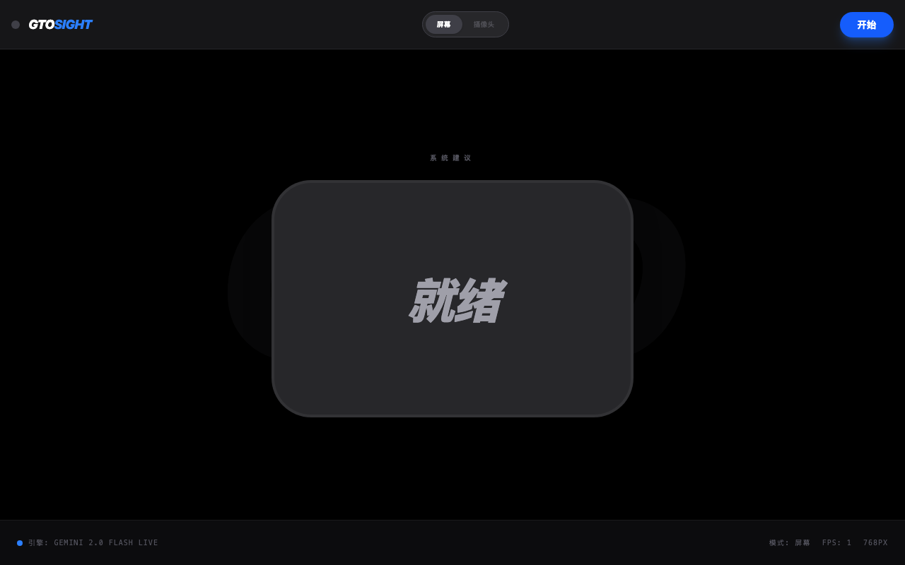
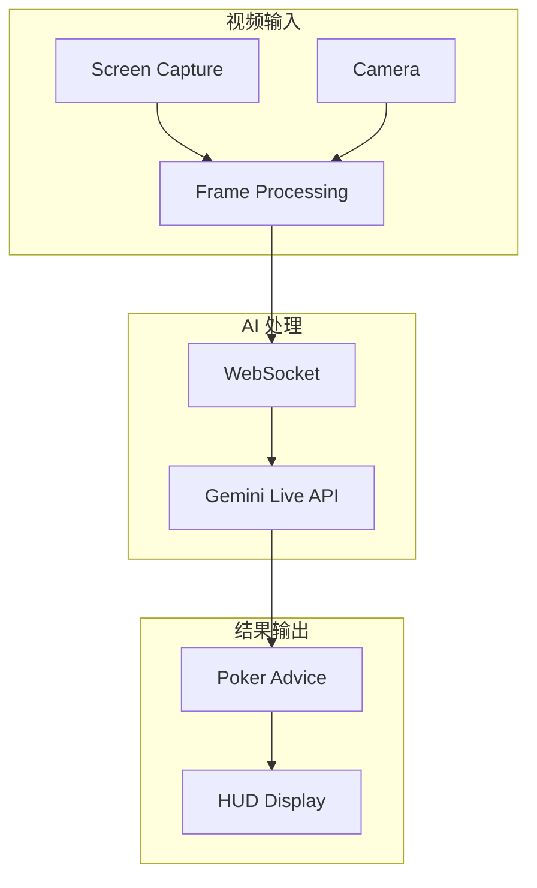

<div align="center">

# PokerSight GTO
> 实时德州扑克 GTO 助手 · Real-time Texas Hold'em GTO Assistant


AI 驱动的实时扑克分析 · GTO 策略建议

__简体中文__ | [English](./README_EN.md)

---
</div>

## 项目简介

**PokerSight GTO** 是一款实时德州扑克 GTO（博弈论最优）助手，通过 Google Gemini Live API 的视觉分析能力，实时识别牌局情况并提供专业的策略建议。

支持屏幕捕获和摄像头两种模式，适用于线上扑克客户端和线下牌局分析。

## 🌟 核心功能

### 1. 📹 双模式捕获

| 模式 | 说明 | 适用场景 |
|------|------|----------|
| **Tab Capture** | 捕获浏览器标签页/应用窗口 | 线上扑克（WePoker 等） |
| **Camera Mode** | 使用手机摄像头扫描 | 线下牌局/实体屏幕 |

### 2. 🧠 AI 实时分析
- **牌面识别**：自动识别公共牌、手牌
- **局势分析**：分析当前牌局状态
- **GTO 建议**：基于博弈论的最优策略建议
- **实时 HUD**：实时显示 AI 分析结果

### 3. 🔧 技术特性
- **自动重连**：处理会话超时和网络问题
- **双语支持**：中英文扑克界面识别
- **移动优化**：适配移动端使用

## 📸 界面预览

| 主界面 | 屏幕捕获 | 摄像头模式 |
|:---:|:---:|:---:|
|  |  |  |

## 🏗️ 技术架构



### 技术栈

| 类别 | 技术 |
|------|------|
| **前端框架** | React 19 + TypeScript 5.8 |
| **构建工具** | Vite 6 |
| **AI 集成** | Google Gemini Live API |
| **实时通信** | WebSocket (ws) |
| **样式** | Tailwind CSS 4 |
| **图标** | Lucide React |

### 关键参数

| 参数 | 值 | 说明 |
|------|-----|------|
| 模型 | gemini-2.5-flash-native-audio-preview-12-2025 | Gemini Live 模型 |
| 帧率 | 1 FPS | 可配置 |
| 图片质量 | 80% JPEG | 压缩率 |
| 最大尺寸 | 768px | 图片最大边长 |
| 会话时长 | 2 分钟 | 自动重连 |

## 📁 目录结构

```
pokersight-gto/
├── src/
│   ├── App.tsx             # 主应用入口
│   ├── components/
│   │   └── PokerHUD.tsx    # 核心 UI 组件
│   ├── services/
│   │   └── geminiLive.ts   # Gemini Live API 服务
│   ├── types.ts            # TypeScript 类型定义
│   └── audioUtils.ts       # 音频处理工具
├── .env.local              # 环境变量
└── README.md
```

## 🚀 快速开始

### 前置要求

- Node.js >= 18
- Gemini API Key
- **VPN 连接**（仅限美国地区，API 限制）

### 安装步骤

```bash
# 1. 克隆仓库
git clone https://github.com/your-username/pokersight-gto.git
cd pokersight-gto

# 2. 安装依赖
npm install

# 3. 配置 API Key
echo "GEMINI_API_KEY=your_api_key_here" > .env.local

# 4. 启动开发服务器
npm run dev
```

### 环境变量

```env
# .env.local
GEMINI_API_KEY=your_gemini_api_key_here
```

## 🎮 使用指南

### 屏幕捕获模式
1. 点击 "Tab Capture" 按钮
2. 选择要捕获的扑克客户端窗口
3. AI 将实时分析牌局并给出建议

### 摄像头模式
1. 点击 "Camera Mode" 按钮
2. 授予摄像头权限
3. 将摄像头对准扑克牌桌/屏幕
4. AI 将实时分析并显示建议

## ⚠️ 注意事项

### API 限制
- Gemini Live API 仅在**美国地区**可用
- 需要稳定的 VPN 连接
- 会话每 2 分钟自动重连

### 浏览器支持
- 推荐使用 Chrome 或 Firefox
- 需要支持屏幕捕获 API

### 使用场景
- 适用于 WePoker 等线上扑克客户端
- 支持中英文界面识别
- 仅供学习和娱乐目的

## 🔧 技术细节

### 系统提示词
AI 经过专门训练，能够识别 WePoker 界面：
- 识别手牌位置
- 识别公共牌
- 分析底池大小
- 判断位置和行动

### 错误处理
- 自动重连机制
- 网络异常恢复
- 会话超时处理

## 📝 开发路线

- [x] 基础 Gemini Live 集成
- [x] 屏幕捕获模式
- [x] 摄像头模式
- [x] HUD 显示
- [ ] 多平台支持（其他扑克客户端）
- [ ] 历史记录功能
- [ ] 离线分析模式

## 🤝 贡献

欢迎提交 Issue 和 Pull Request！

## 📄 许可证

MIT License - 详见 [LICENSE](./LICENSE)

## 🙏 致谢

- [Google Gemini](https://ai.google.dev/) - Gemini Live API
- [React](https://react.dev/) - 前端框架

---

<div align="center">

**提升你的扑克策略 🃏**

</div>
